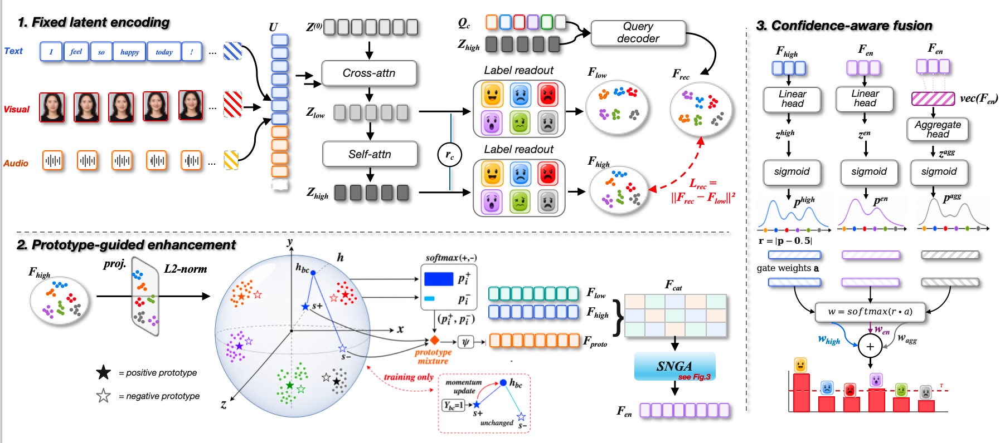

<div align="center">

# MERP

### Multimodal Emotion Recognition with Perceiver IO

**Language · Vision · Acoustics → Shared latent space → Multi-label emotions**

[](https://creative-zcx.github.io/MERP/)
[](https://pytorch.org/)
[](#data)

<p>
  A research implementation for multimodal, multi-label emotion recognition.<br>
  MERP fuses text, visual, and acoustic signals through a compact Perceiver IO latent space.
</p>

**[View the interactive project page →](https://creative-zcx.github.io/MERP/)**

</div>

---

## Overview

Emotion rarely lives in a single signal. MERP combines *what is said*, *how it sounds*, and *what can be seen* to model emotional context across three modalities. The implementation supports aligned and unaligned CMU-MOSEI features, multi-label classification, and controlled missing-modality evaluation.

### Highlights

- **Multimodal fusion** — text, visual, and acoustic streams meet in one shared representation.
- **Perceiver IO backbone** — Fourier-encoded inputs cross-attend into a configurable latent bottleneck.
- **Label-aware prediction** — trainable output queries and multi-label attention decode six emotion labels.
- **Rich representation learning** — prototype memory, contrastive objectives, reconstruction, and gated score fusion.
- **Robustness evaluation** — deterministic masking supports experiments with missing modalities.
- **Flexible input alignment** — loaders are provided for both aligned and unaligned feature sequences.

## Architecture

<p align="center">
  <a href="https://creative-zcx.github.io/MERP/#architecture">
    
  </a>
</p>

<p align="center"><sub><b>MERP architecture.</b> The framework combines fixed latent encoding, prototype-guided enhancement, and confidence-aware fusion for robust multimodal multi-label emotion recognition.</sub></p>

At its center, MERP maps text, visual, and acoustic streams into a fixed latent sequence. Cross-attention and self-attention produce low- and high-level representations, while label readout builds emotion-specific features. Prototype-guided enhancement strengthens class structure in the representation space, and confidence-aware fusion combines complementary predictions into the final multi-label output.

## Quick start

### 1. Clone the repository

```bash
git clone git@github.com:Creative-zcx/MERP.git
cd MERP
```

### 2. Prepare the environment

The training code requires Python, PyTorch, NumPy, and a CUDA-capable environment. Install versions appropriate for your CUDA setup before running training.

### 3. Configure the dataset

Set `--data_path` in [`train.sh`](train.sh) or pass it directly to `main.py`. For unaligned experiments, also prepare `data/mosei_senti_data_noalign.pkl`.

### 4. Train

```bash
chmod +x train.sh
./train.sh
```

The default script launches a single-process aligned-data run with `torchrun`. Important model and optimization options are exposed in [`main.py`](main.py), including latent count, attention depth, dropout, missing-modality probability, and individual loss weights.

## Data

This implementation targets **CMU-MOSEI** features.

| Variant | Resource |
| --- | --- |
| Aligned features | [Google Drive](https://drive.google.com/file/d/1A7HTBxle5AOFt66mqNIRDM3DOws_tNXH/view) |
| Unaligned features | [Baidu Netdisk](https://pan.baidu.com/s/1w600ia_V_NlLcLhNp9TSbw&key=wy4s) · extraction key `wy4s` |

Please follow the dataset's original terms and licensing requirements.

## Core configuration

| Option | Default | Purpose |
| --- | ---: | --- |
| `--num_latents` | `80` | Number of Perceiver latent vectors |
| `--num_self_attends` | `6` | Self-attention layers per block |
| `--num_blocks` | `1` | Number of Perceiver blocks |
| `--fourier_num_bands` | `32` | Frequency bands for positional encoding |
| `--hidden_size` | `256` | Shared hidden representation size |
| `--proj_size` | `64` | Contrastive projection size |
| `--missing_prob` | `0.2` | Probability used in missing-modality evaluation |
| `--binary_threshold` | `0.35` | Multi-label decision threshold |

## Repository layout

```text
MERP/
├── main.py                 # training and evaluation entry point
├── train.sh                # default experiment launcher
├── dataloaders/            # aligned and unaligned CMU-MOSEI loaders
├── models/                 # MERP model, losses, encoders, optimization
├── perceiver_io/           # Perceiver IO components and preprocessors
├── utils/                  # metrics and shared utilities
└── docs/                   # interactive GitHub Pages website
```

## Project page

The interactive website is built as a dependency-free static page and deployed from [`docs/`](docs/):

### **[creative-zcx.github.io/MERP](https://creative-zcx.github.io/MERP/)**

---

<div align="center">
  <sub>Built for multimodal emotion recognition research on CMU-MOSEI.</sub>
</div>
